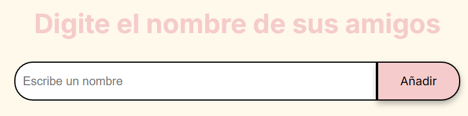
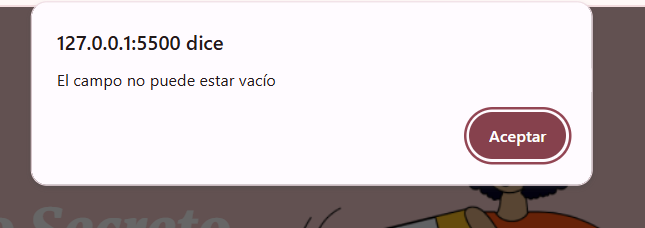
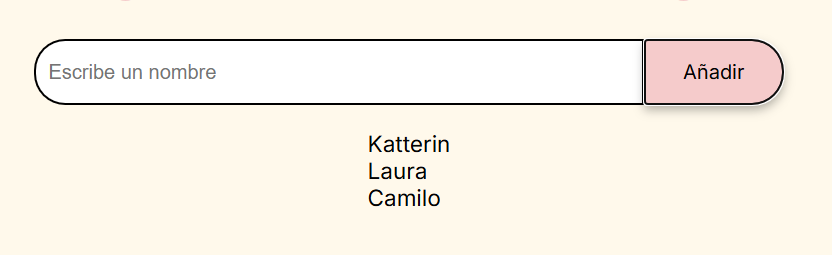
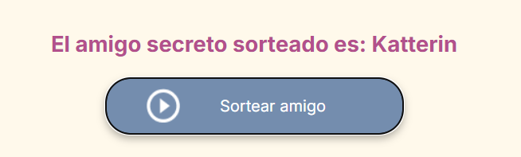

# 🎁 Amigo Secreto - Sorteador de Nombres

Esta es una aplicación web sencilla para jugar **Amigo Secreto**.  
Permite agregar nombres (jugadores), mostrarlos en una lista y realizar un sorteo aleatorio para elegir a uno de ellos.


---

## ✨ Funcionalidades

- **Agregar jugadores:** Escribe un nombre y añádelo a la lista.


- **Validación:** No se permiten campos vacíos; si intentas añadir uno, se mostrará una alerta.


- **Visualización:** La lista de jugadores se actualiza automáticamente cada vez que se agrega un nuevo nombre.

    

- **Sorteo aleatorio:** Escoge al azar uno de los jugadores de la lista.


- **Interactividad inmediata:** Todo el proceso ocurre en la misma página, sin recargar.

---

## 📂 Estructura del Proyecto

```plaintext
Challenge Amigo Secreto/
├── assets/                 → Archivos de recursos (imágenes, iconos).
│   ├── amigo-secreto.png
│   └── play_circle_outline.png
├── img-readme/              → Imágenes usadas en el README.
│   ├── añadirAmigo.png
│   ├── index.png
│   ├── listaAmigos.png
│   ├── sorteoAmigo.png
│   └── validación.png
├── app.js                   → Lógica principal de la aplicación.
├── image                    → Imagen PNG.
├── index                    → Archivo HTML principal.
├── README                   → Documento de descripción del proyecto.
└── style                    → Estilos CSS para la interfaz.
````

---

## 🚀 Instalación y Ejecución

1. **Clonar el repositorio**
- git clone https://github.com/tu-usuario/amigo-secreto.git

2. **Abrir el proyecto**
- No se requiere instalación de dependencias.
- Simplemente abre el archivo `index.html` en cualquier navegador web.

---

# 📜 Licencia

Este proyecto está bajo la **Licencia MIT**.  

✅ **Eres libre de:**
- Usarlo 🛠️  
- Modificarlo ✏️  
- Distribuirlo 🚀  

> La Licencia MIT es simple y permisiva, ideal para proyectos de código abierto.  
> ¡Haz lo que quieras, pero no olvides dar crédito al autor! 🙌


